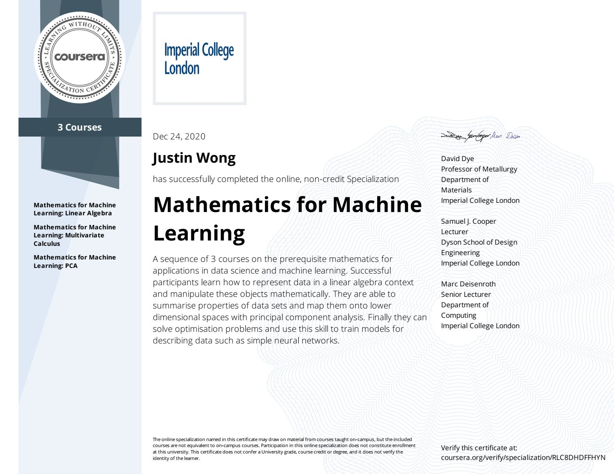

# Coursera Mathematics for Machine Learning

This repository contains my solutions for the labs of Imperial College London and Coursera's Mathematics for Machine Learning specialization.

The specialization contains three courses:

1. Linear algebra
2. Multivariate calculus
3. Principal component analysis (PCA)

## Mathematics for Machine Learning specialization certificate

